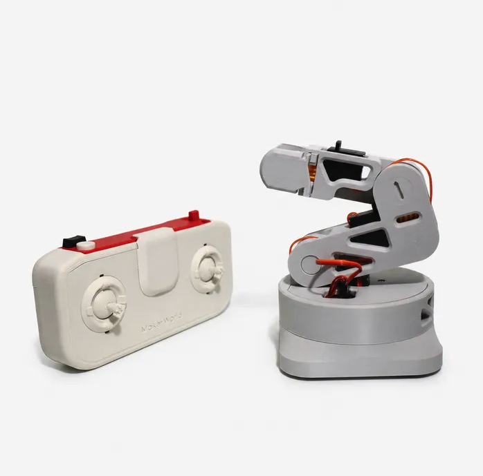

# cyberbrick-l-one-control
Custom control modules for the [CyberBrick L-One](https://us.store.bambulab.com/products/l-one-desktop-robotic-arm-cyberbrick-rc).




## Getting Started

Clone the environment and change directories. The following uses cloning via ssh:

```bash
git clone git@github.com:mht3/cyberbrick-l-one-control.git
cd cyberbrick-l-one-control
```

### Environment Setup

Create a new conda environment with Python 3.11.
```bash
conda create -n cyberbrick python=3.11
```

Activate the environment.
```sh
conda activate cyberbrick
```

Install torch

<details>
<summary>PyTorch on GPU</summary>
<br>
Install a CUDA enabled PyTorch that matches your system architecture.
  
```sh
pip install -U torch==2.7.0 torchvision==0.22.0 --index-url https://download.pytorch.org/whl/cu128
```
</details>

<details>
<summary>PyTorch on CPU Only</summary>
<br>
Alternatively, install PyTorch on the CPU.
  
```sh
pip install torch==2.7.0 torchvision==0.22.0 --index-url https://download.pytorch.org/whl/cpu
```
</details>


Install the package and its dependencies in editable mode.

```sh
pip install -e ".[dev]"
```

Run the tests to make sure the codebase is setup properly. If all tests pass, you're good to go!

```sh
pytest tests/
```

## Project Layout

- [`LOneGripper/`](LOneGripper/) -- receiver firmware (the arm/gripper) for the CyberBrick core board.
- [`LOneRC/`](LOneRC/) -- transmitter firmware for the handheld remote.
- [`virtual_gripper.py`](virtual_gripper.py) -- host-side GUI for driving the arm directly, either over USB (raw REPL) or over WiFi (via `LOneGripper/wifi_bridge.py`).
- [`test_motors.py`](test_motors.py) -- step-through hardware test for each configured motor/servo channel; reuses the USB link from `virtual_gripper.py`.

Both `LOneGripper/` and `LOneRC/` share a `bbl/` module (buzzer, motors, servos, LEDs, sleep) and an `app/` folder (`control`, `devices`, `parser`, `rc_main`) that build on [CyberBrick's `CyberBrick_Controller_Core`](https://github.com/CyberBrick-Official/CyberBrick_Controller_Core) firmware -- `bbl/` is used as-is from core, while `boot.py`/`rc_main.py` extend core's versions with WiFi-fallback behavior. See [`LICENSE`](LICENSE) -- code derived from core carries CyberBrick's own license terms in addition to this repo's.

## Firmware Setup (on-device)

1. Copy `LOneGripper/wifi_secrets.example.py` to `LOneGripper/wifi_secrets.py` and fill in your own `AP_SSID`/`AP_PASSWORD`/`STA_SSID`/`STA_PASSWORD`.
2. Upload the contents of `LOneGripper/` (for the receiver board) or `LOneRC/` (for the transmitter board) to the CyberBrick core board's filesystem, e.g. with [Pymakr](https://marketplace.visualstudio.com/items?itemName=pycom.Pymakr) (each folder has a `pymakr.conf`) or `mpremote`/Thonny.
3. Power on the transmitter first, then the receiver, so they pair over ESP-NOW. If the receiver doesn't see a transmitter within `NO_PAIRING_FALLBACK_TIMEOUT` seconds of boot, it falls back to WiFi mode automatically (see `LOneGripper/boot.py`) so `virtual_gripper.py` can still reach it.